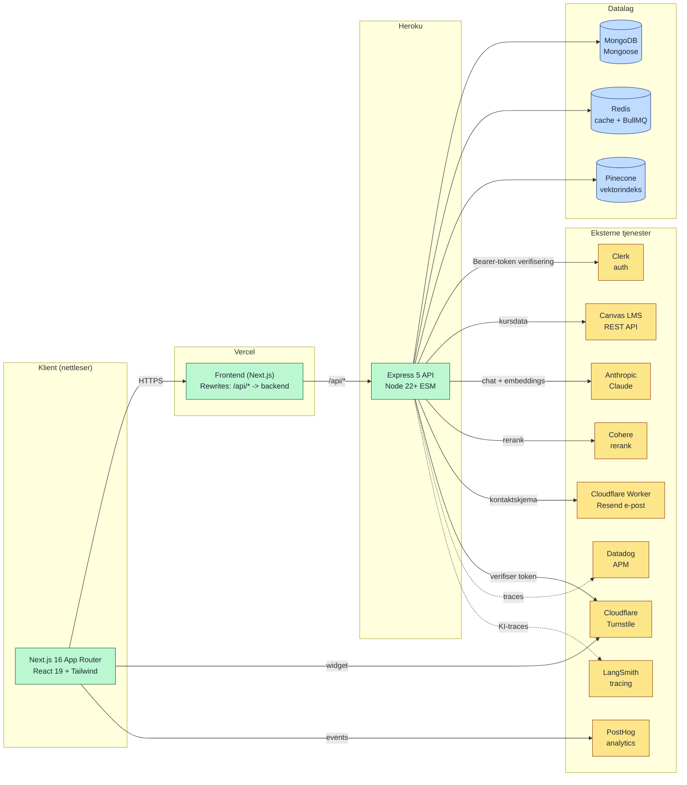

# Overordnet systemarkitektur

Viser de viktigste komponentene i StudyWise og hvordan de henger sammen — frontend, backend, datalag og eksterne tjenester.

```mermaid
flowchart LR
    subgraph Klient["Klient (nettleser)"]
        UI["Next.js 16 App Router<br/>React 19 + Tailwind"]
    end

    subgraph Vercel["Vercel"]
        FE["Frontend (Next.js)<br/>Rewrites: /api/* -> backend"]
    end

    subgraph Heroku["Heroku"]
        BE["Express 5 API<br/>Node 22+ ESM"]
    end

    subgraph Datalag["Datalag"]
        MONGO[("MongoDB<br/>Mongoose")]
        REDIS[("Redis<br/>cache + BullMQ")]
        PINE[("Pinecone<br/>vektorindeks")]
    end

    subgraph Eksterne["Eksterne tjenester"]
        CLERK["Clerk<br/>auth"]
        CANVAS["Canvas LMS<br/>REST API"]
        ANTH["Anthropic<br/>Claude"]
        COHERE["Cohere<br/>rerank"]
        TURN["Cloudflare<br/>Turnstile"]
        POSTHOG["PostHog<br/>analytics"]
        DD["Datadog<br/>APM"]
        LANG["LangSmith<br/>tracing"]
        CFW["Cloudflare Worker<br/>Resend e-post"]
    end

    UI -->|HTTPS| FE
    FE -->|/api/*| BE

    BE --> MONGO
    BE --> REDIS
    BE --> PINE

    BE -->|Bearer-token verifisering| CLERK
    BE -->|kursdata| CANVAS
    BE -->|chat + embeddings| ANTH
    BE -->|rerank| COHERE
    BE -->|kontaktskjema| CFW

    UI -->|widget| TURN
    BE -->|verifiser token| TURN
    UI -->|events| POSTHOG

    BE -.->|traces| DD
    BE -.->|KI-traces| LANG

    classDef ext fill:#fde68a,stroke:#92400e,color:#1f2937
    classDef data fill:#bfdbfe,stroke:#1e3a8a,color:#1f2937
    classDef app fill:#bbf7d0,stroke:#166534,color:#1f2937
    class CLERK,CANVAS,ANTH,COHERE,TURN,POSTHOG,DD,LANG,CFW ext
    class MONGO,REDIS,PINE data
    class FE,BE,UI app
```
