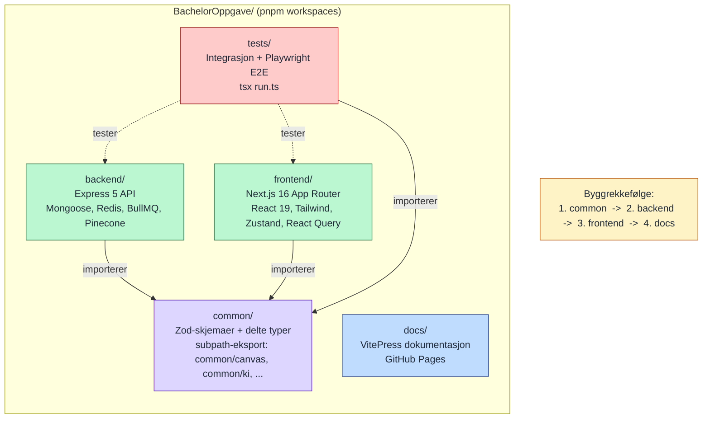

# Monorepo-struktur (pnpm workspaces)

Viser de fem workspace-pakkene, byggrekkefølgen og hvilke avhengigheter som er delt. `common` må bygges først fordi både `backend` og `frontend` importerer typene derfra. Pakken fungerer som fullstack-kontrakten i prosjektet: skjemaendringer defineres med Zod i `common`, valideres i backend og brukes som typer i frontend og tester.

