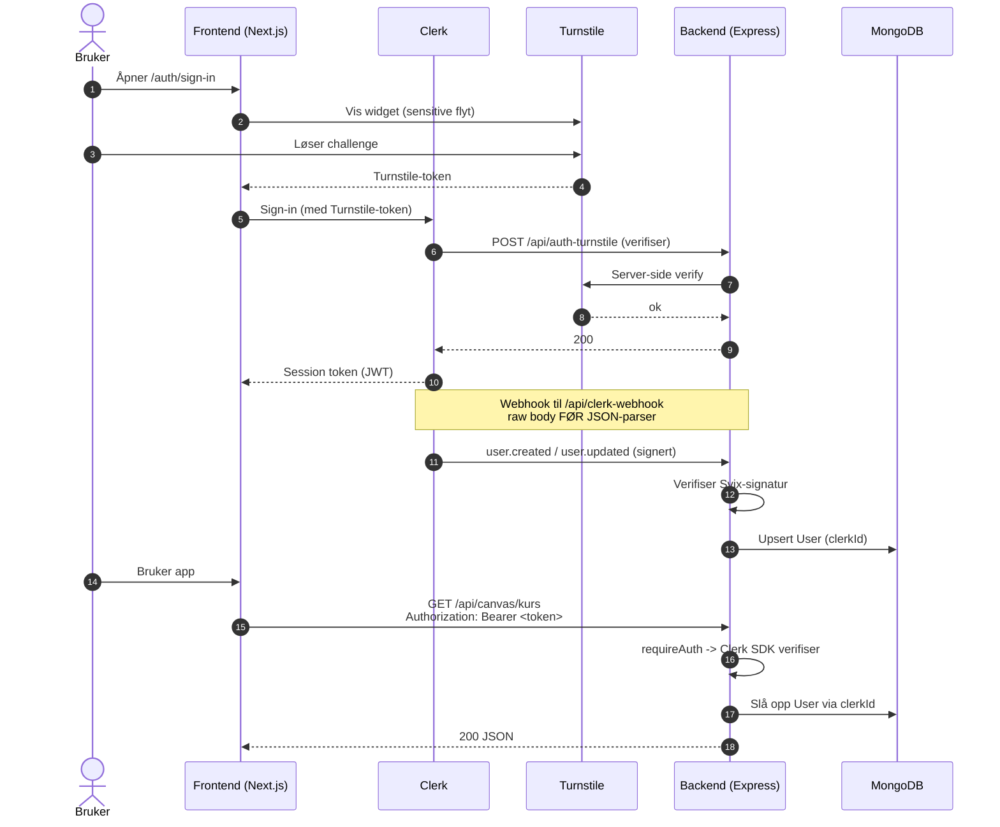

# Autentiseringsflyt (Clerk + Turnstile)

Sekvensdiagram for innlogging og påfølgende API-kall. Clerk håndterer identitet; Cloudflare Turnstile beskytter sensitive flyter; backend verifiserer token og synker brukeren til lokal `User`-modell. Webhook fra Clerk leveres med rå body før JSON-parser.

