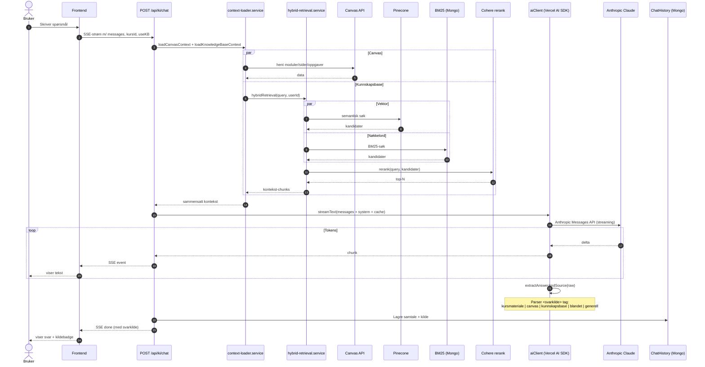

# KI-chat-pipeline (sequence)

Hele veien fra brukerens spørsmål til streamet svar med kildebadge. Pipelinen henter Canvas-kontekst og kunnskapsbase-kontekst hvis aktivert, sender til Claude via Vercel AI SDK med prompt-caching, og parser ut `<svarkilde>`-taggen før den lagres og streames til frontend.

