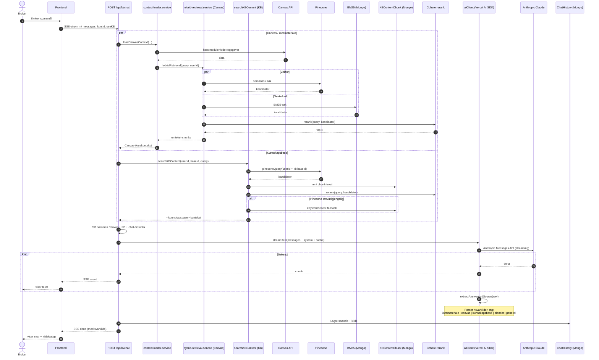

# KI-chat-pipeline (sequence)

Hele veien fra brukerens spørsmål til streamet svar med kildebadge. Pipelinen henter Canvas-/kursmateriale-kontekst via `context-loader.service`, henter aktiv kunnskapsbase via `searchKBContent` hvis brukeren har valgt en base, sender samlet kontekst til Claude via Vercel AI SDK med prompt-caching, og parser ut `<svarkilde>`-taggen før svaret lagres og streames til frontend.

