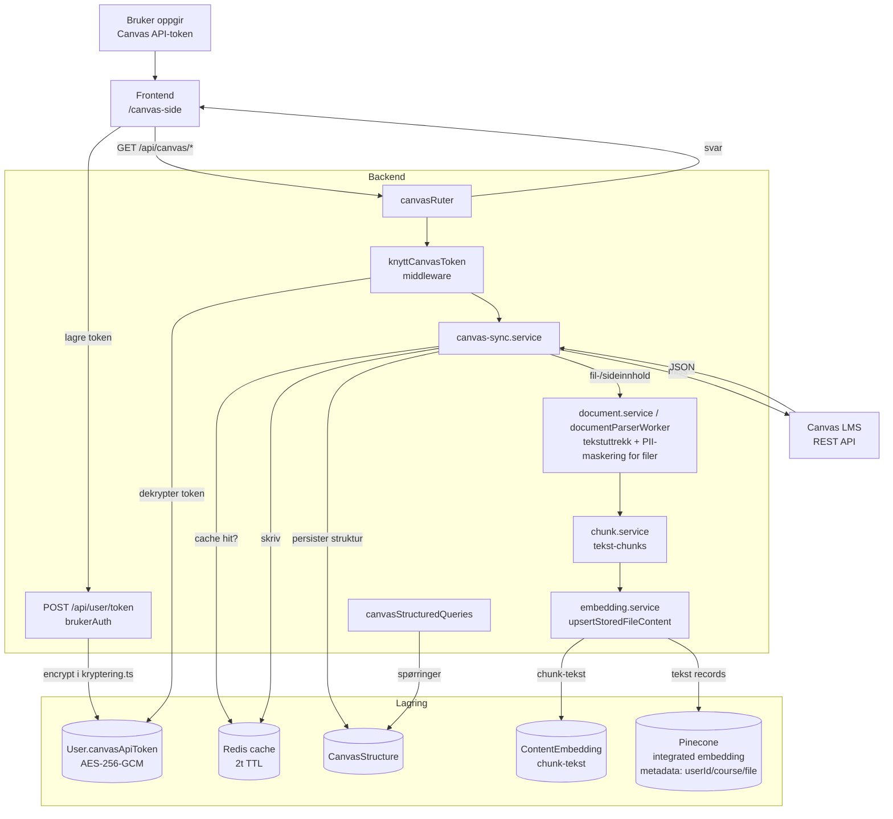

# Canvas-integrasjon

Hvordan Canvas-data flyter fra LMS til StudyWise. Tokens sendes til backend og lagres kryptert (AES-256-GCM) i `User`, Canvas-svar caches i Redis (2t TTL), strukturen lagres i `CanvasStructure`, og fil-/sideinnhold lagres som `ContentEmbedding`-chunks og synkroniseres til Pinecone via `embedding.service`.

