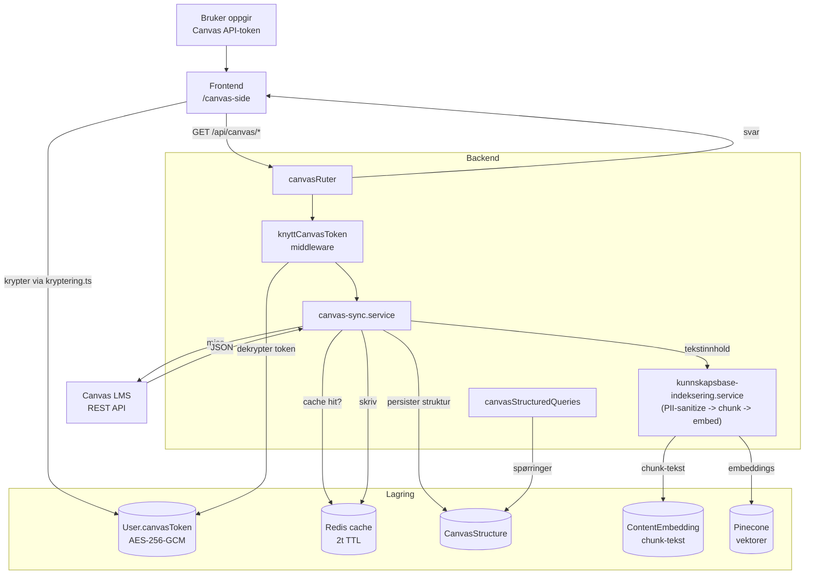

# Canvas-integrasjon

Hvordan Canvas-data flyter fra LMS til StudyWise. Tokens lagres kryptert (AES-256-GCM) i `User`, Canvas-svar caches i Redis (2t TTL), strukturen lagres i `CanvasStructure`, og innhold indekseres til Pinecone via `ContentEmbedding` for senere søk.

