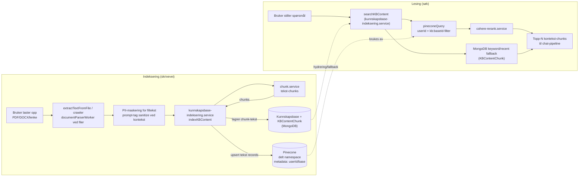

# Kunnskapsbase — RAG-søk

RAG-flyt for brukerens private kunnskapsbase. Skriveveien lagrer chunks i `KBContentChunk` og upsert-er tekstrecords til Pinecone. Leseveien bruker `searchKBContent`: Pinecone semantisk søk med `userId` + `kb:<baseId>`-filter, Cohere-rerank ved treff og MongoDB keyword/recent fallback når Pinecone ikke gir brukbare resultater.

