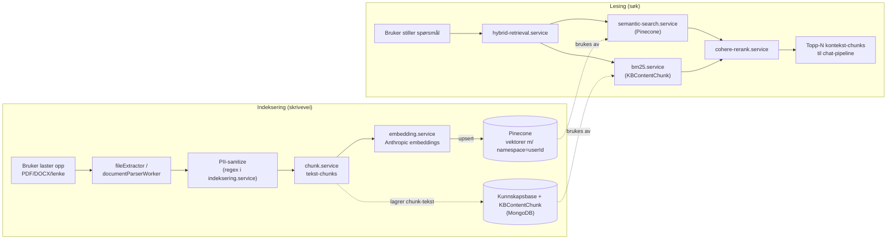

# Kunnskapsbase — hybrid RAG

To parallelle søkeveier (vektor + nøkkelord) mot brukerens private kunnskapsbase, slått sammen og rerangert av Cohere. PII fjernes før innhold sendes til Pinecone — det er den siste grensen før data forlater backend.

