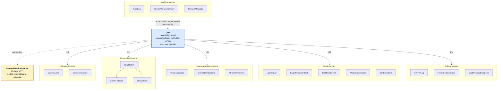

# Database-modeller — forenklet (for hovedrapport, Figur 5)

Forenklet versjon av ER-diagrammet i `07-database-modeller.md`. Brukes som Figur 5 i hovedrapporten (kap. 3.3.3). Den fullstendige modellen med alle felt og typer ligger i Vedlegg G.

`User` er navet. Tilknyttede collections er gruppert etter domene for å gjøre figuren lesbar på portrait A4. Pilene angir relasjonens kardinalitet fra `User`.

## Lesehjelp

- **User** er sentral. `canvasApiToken` lagres kryptert med AES-256-GCM (jf. kap. 3.4.2 og Figur 9).
- **Canvas-domene** (1:1): `CanvasUser` lagrer Canvas-profilinfo for den lokale brukeren. `CanvasStructure` cacher kursstruktur som moduler, sider og oppgaver.
- **KI- og chatdomene** (1:N): `ChatHistory` lagrer samtaler. Hver samtale kan ha `ChatFeedback` (tommel opp/ned) og `SharedChat` (delt via lenke med utløpstid).
- **Kunnskapsbase-domene** (1:N): `Kunnskapsbase` representerer en opplastet ressurs (PDF, DOCX, URL m.fl.). Tekst chunkes til `KBContentChunk` og indekseres som `ContentEmbedding` (vektorer ligger i Pinecone, tekst i Mongo).
- **Studieverktøy** (1:N): KI-genererte artefakter som quiz, flashcards, oppgavenedbrytning, ukeplan og studiekontekst.
- **Audit og admin** (N:1 mot User): `AuditLog` peker tilbake til User via `actorUserId` og `targetUserId`. Disse pseudonymiseres ved kontosletting.
- **DeletedUserTombstone** (1:1 ved sletting): Beholder minimal idempotency-state i 90 dager etter at `User` er slettet, slik at samme Clerk-konto ikke kan gjenopprettes og forårsake duplikater eller orphaned vectors.

## Hvor er den fullstendige versjonen?

Denne forenklede varianten er eksportert som `png/07-database-modeller-forenklet.png`. Det detaljerte ER-diagrammet med alle felt og typer ligger i `07-database-modeller.md` og som PNG i `png/07-database-modeller.png`. Det henvises til derfra i Vedlegg G (teknisk diagramkatalog).
