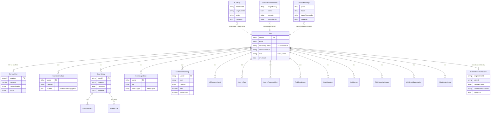

# Database-modeller (MongoDB / Mongoose)

Forenklet ER-diagram over de viktigste collection-ene. `User` er navet, og de fleste andre dokumenter har `userId` som referanse. Ved kontosletting hard-slettes `User` og tilknyttede brukerdata, mens `DeletedUserTombstone` beholder minimal konflikt-/idempotency-state med 90 dagers TTL. Audit-logging og chat-tilbakemelding er separate collections.

