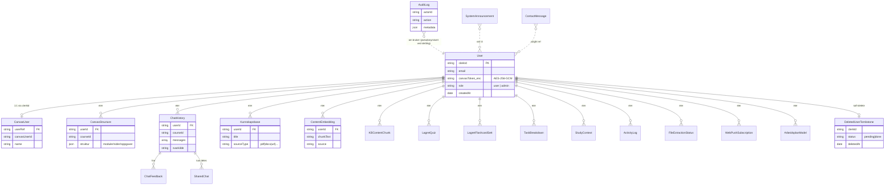

# Database-modeller (MongoDB / Mongoose)

Forenklet ER-diagram over de viktigste collection-ene. `User` er navet, og de fleste andre dokumenter har `userId` som referanse. Soft-delete styres via `DeletedUserTombstone`. Audit-logging og chat-tilbakemelding er separate collections.

