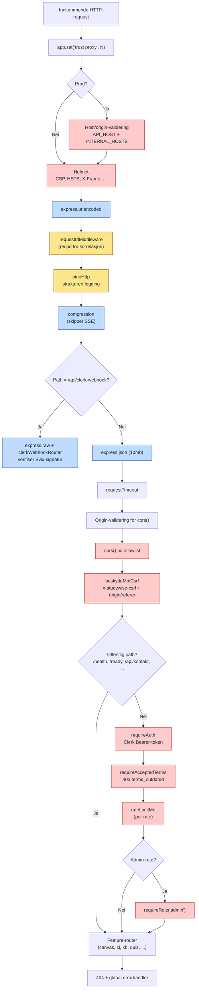

# Middleware-stack (Express)

Rekkefølgen på middleware i `backend/src/index.ts` er sikkerhetskritisk. Clerk-webhook trenger rå body **før** JSON-parser, CSRF kjører **etter** CORS, og rate-limit kjører **før** `requireAuth`. Diagrammet leses ovenfra og ned i kjøringsrekkefølge.

