# Middleware-stack (Express)

Rekkefølgen på middleware i `backend/src/index.ts` er sikkerhetskritisk. Clerk-webhook trenger rå body **før** JSON-parser, Cloudflare-only håndheves tidlig i produksjon, og CSRF kjører **etter** CORS. Rate limiting ligger enten på public abuse-endepunkter før auth, eller på beskyttede feature-/admin-ruter etter at bruker og rolle er kjent. Diagrammet leses ovenfra og ned i kjøringsrekkefølge.

```mermaid
flowchart TB
    REQ["Innkommende HTTP-request"] --> TP["app.set('trust proxy', N)"]
    TP --> HOST{"Prod?"}
    HOST -- Ja --> HV["Host/origin-validering<br/>API_HOST + INTERNAL_HOSTS"]
    HOST -- Nei --> HELM
    HV --> CFO{"ENFORCE_<br/>CLOUDFLARE_<br/>ONLY?"}
    CFO -- Ja --> CFE["requireCloudflare<br/>CF-Connecting-IP + X-Forwarded-For<br/>peer-IP i CF-ranges (403 ellers)<br/>unntak: /health og /ready"]
    CFO -- Nei --> HELM
    CFE --> HELM["Helmet<br/>CSP, HSTS, X-Frame, ..."]
    HELM --> URL["express.urlencoded"]
    URL --> RID["requestIdMiddleware<br/>(req.id for korrelasjon)"]
    RID --> LOG["pinoHttp<br/>strukturert logging"]
    LOG --> COMP["compression<br/>(skipper SSE)"]
    COMP --> WH{"Path = /api/clerk-webhook?"}
    WH -- Ja --> RAW["express.raw + clerkWebhookRouter<br/>verifiser Svix-signatur"]
    WH -- Nei --> JSON["express.json (10mb)"]
    JSON --> TO["requestTimeout"]
    TO --> ORIG["Origin-validering før cors()"]
    ORIG --> CORS["cors() m/ allowlist"]
    CORS --> CSRF["beskytteMotCsrf<br/>x-studywise-csrf + origin/referer"]
    CSRF --> PUB{"Offentlig path?<br/>/health, /ready, /api/kontakt, ..."}
    PUB -- Ja --> ROUTE
    PUB -- Nei --> AUTH["requireAuth<br/>Clerk Bearer-token"]
    AUTH --> TERMS["requireAcceptedTerms<br/>403 terms_outdated"]
    TERMS --> RL["route/admin rate limits<br/>(per IP / bruker / rute)"]
    RL --> ROLE{"Admin-rute?"}
    ROLE -- Ja --> RR["requireRole('admin')"]
    ROLE -- Nei --> ROUTE["Feature-router<br/>(canvas, ki, kb, quiz, ...)"]
    RR --> ROUTE
    ROUTE --> H404["404 + global errorhandler"]

    classDef sec fill:#fecaca,stroke:#991b1b,color:#1f2937
    classDef parse fill:#bfdbfe,stroke:#1e3a8a,color:#1f2937
    classDef obs fill:#fde68a,stroke:#92400e,color:#1f2937
    class HV,CFE,HELM,CORS,CSRF,AUTH,TERMS,RL,RR sec
    class URL,JSON,RAW,COMP parse
    class RID,LOG obs
```

