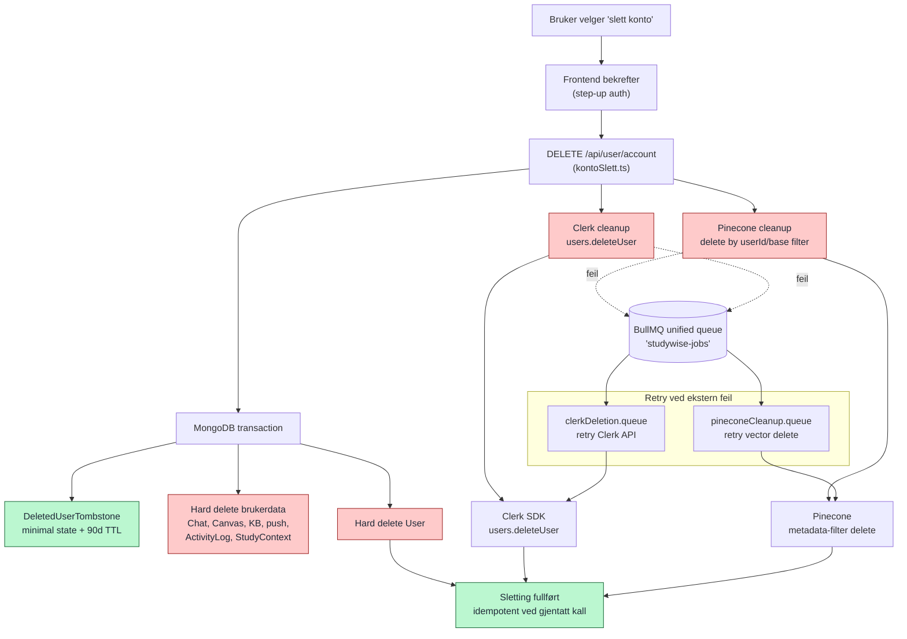

# Bruker-sletting (hard delete + tombstone + retry-kø)

Kontosletting går gjennom `kontoSlett.ts`, ikke direkte mot `User`. Backend kjører en MongoDB-transaksjon som oppretter en minimal `DeletedUserTombstone` (90 dagers TTL) og hard-sletter `User` samt brukerens tilknyttede data. Pinecone- og Clerk-sletting forsøkes synkront etter transaksjonen; BullMQ brukes som retry-mekanisme hvis en ekstern sletting feiler.

