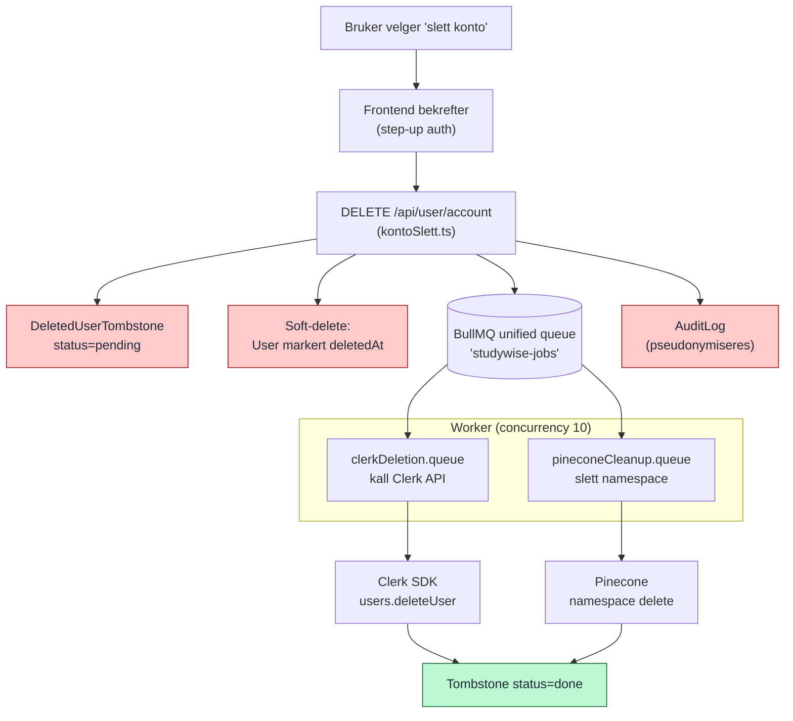

# Bruker-sletting (soft-delete + BullMQ)

Sletting går aldri direkte mot `User`. I stedet markeres en `DeletedUserTombstone`, og to BullMQ-jobber (i den unified køen) rydder opp asynkront i Clerk og Pinecone. AuditLog beholdes, men pseudonymiseres.

