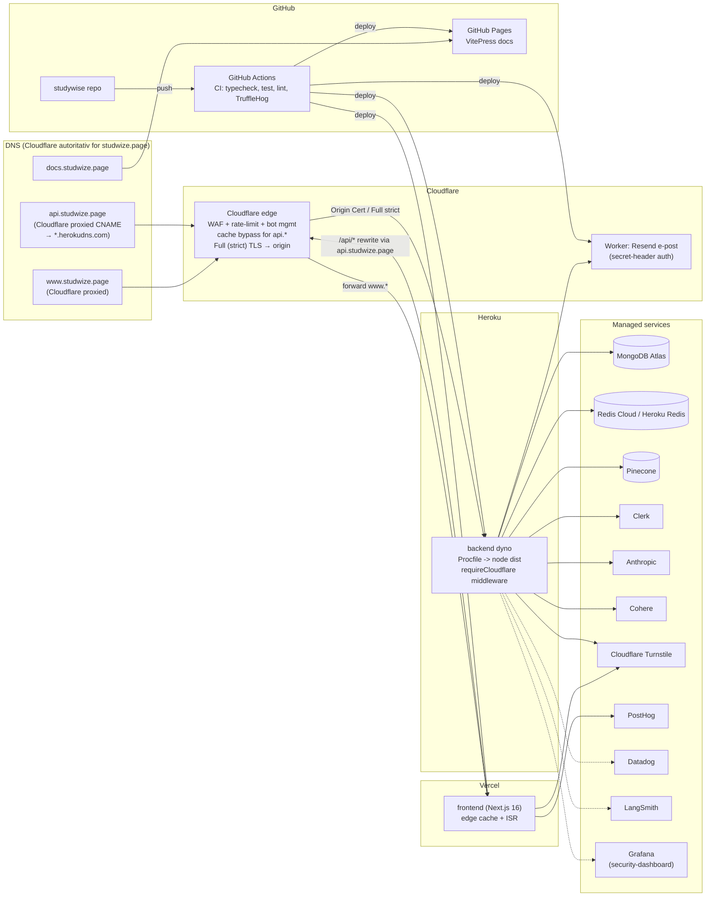

# Deployment-arkitektur

Hvilke deler kjøres hvor i offentlig demo / produksjonslik deploy. Frontend ligger på Vercel, backend på Heroku, dokumentasjon på GitHub Pages, og Resend-relayet er en Cloudflare Worker. Cloudflare er autoritativ DNS, CDN/WAF og TLS-edge for domenet; Name.com er kun registrar.

`www.studwize.page` proxies via Cloudflare til Vercel. `api.studwize.page` er en Cloudflare-proxied CNAME til Heroku DNS-target (`corrugated-wave-vyjr94evcbe31gfvdi5vvqw3.herokudns.com`). Heroku-targetet er origin-adresse, ikke en offentlig API-base URL.

Transportlaget er delt i to krypterte ledd: bruker til Cloudflare termineres med Universal SSL (minimum TLS 1.2 på edge), og Cloudflare til Heroku kjører Full (strict) TLS mot et installert Cloudflare Origin Certificate (wildcard, gyldig til 2041). Backend håndhever at API-trafikk faktisk kommer via Cloudflare med `requireCloudflare` (`ENFORCE_CLOUDFLARE_ONLY=true`): peer-IP fra siste hop i `X-Forwarded-For` må være innenfor Cloudflares offisielle IPv4/IPv6-ranges, og `CF-Connecting-IP` må være satt. Ellers returneres `403`.

Vercel `INTERNAL_API_URL` peker derfor på `https://api.studwize.page`, ikke på Heroku-DNS-targetet. Dermed går også Next.js SSR/rewrites via Cloudflare før de når Heroku. En Cloudflare cache rule (`http.host eq "api.studwize.page" -> Bypass cache`) sørger for at API-responser med auth/persondata ikke caches på Cloudflare-edge.

