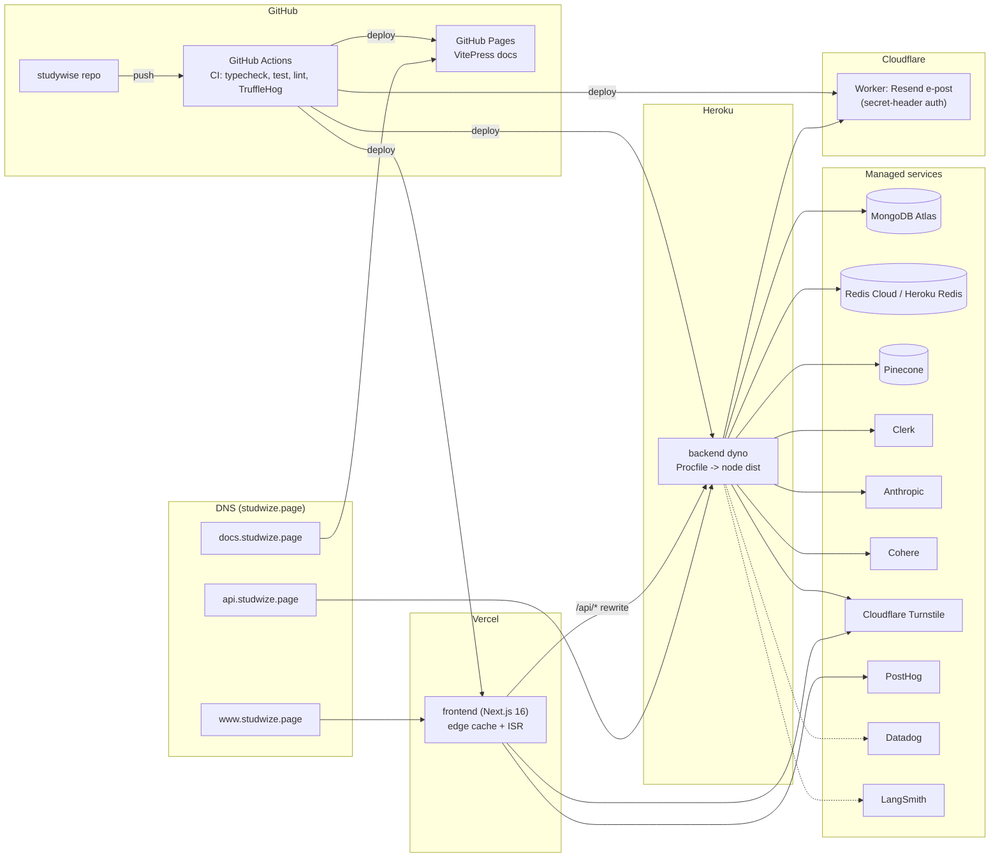

# Deployment-arkitektur

Hvilke deler kjøres hvor i produksjon. Frontend ligger på Vercel, backend på Heroku, dokumentasjon på GitHub Pages, og Resend-relayet er en Cloudflare Worker. Eksterne data-/KI-tjenester er managed.

