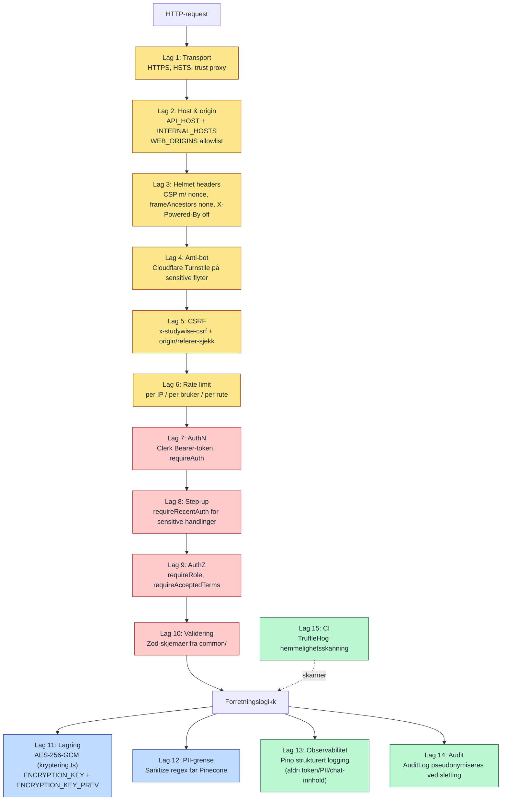

# Sikkerhetslag (defense in depth)

Lagene som beskytter StudyWise. Hvert lag er en uavhengig sjekk — ingen av dem kan skrus av uten at det blir en regresjon (jf. CLAUDE.md guardrails).

```mermaid
flowchart TB
    REQ["HTTP-request"]
    L1["Lag 1: Transport<br/>HTTPS, HSTS, trust proxy"]
    L2["Lag 2: Host & origin<br/>API_HOST + INTERNAL_HOSTS<br/>WEB_ORIGINS allowlist"]
    L3["Lag 3: Helmet headers<br/>CSP m/ nonce, frameAncestors none, X-Powered-By off"]
    L4["Lag 4: Anti-bot<br/>Cloudflare Turnstile på sensitive flyter"]
    L5["Lag 5: CSRF<br/>x-studywise-csrf + origin/referer-sjekk"]
    L6["Lag 6: Rate limit<br/>per IP / per bruker / per rute"]
    L7["Lag 7: AuthN<br/>Clerk Bearer-token, requireAuth"]
    L8["Lag 8: Step-up<br/>requireRecentAuth for sensitive handlinger"]
    L9["Lag 9: AuthZ<br/>requireRole, requireAcceptedTerms"]
    L10["Lag 10: Validering<br/>Zod-skjemaer fra common/"]
    L11["Lag 11: Lagring<br/>AES-256-GCM (kryptering.ts)<br/>ENCRYPTION_KEY + ENCRYPTION_KEY_PREV"]
    L12["Lag 12: PII-grense<br/>Sanitize regex før Pinecone"]
    L13["Lag 13: Observabilitet<br/>Pino strukturert logging<br/>(aldri token/PII/chat-innhold)"]
    L14["Lag 14: Audit<br/>AuditLog pseudonymiseres ved sletting"]
    L15["Lag 15: CI<br/>TruffleHog hemmelighetsskanning"]
    APP["Forretningslogikk"]

    REQ --> L1 --> L2 --> L3 --> L4 --> L5 --> L6 --> L7 --> L8 --> L9 --> L10 --> APP
    APP --> L11
    APP --> L12
    APP --> L13
    APP --> L14
    L15 -.skanner.-> APP

    classDef edge fill:#fde68a,stroke:#92400e,color:#1f2937
    classDef auth fill:#fecaca,stroke:#991b1b,color:#1f2937
    classDef data fill:#bfdbfe,stroke:#1e3a8a,color:#1f2937
    classDef ops fill:#bbf7d0,stroke:#166534,color:#1f2937
    class L1,L2,L3,L4,L5,L6 edge
    class L7,L8,L9,L10 auth
    class L11,L12 data
    class L13,L14,L15 ops
```
