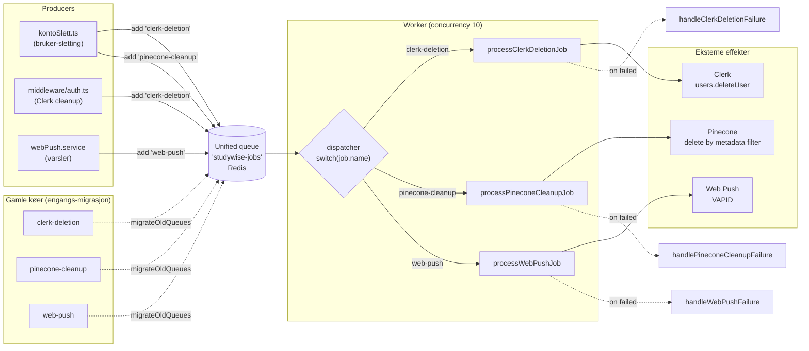

# BullMQ unified queue

Tre logiske job-typer prosesseres av én Worker på én kø (`studywise-jobs`) for å redusere antall Redis-tilkoblinger fra 8 til 4 per instans. Diagrammet viser dispatcher-mønsteret og hvordan jobs migreres fra de gamle separate køene.

