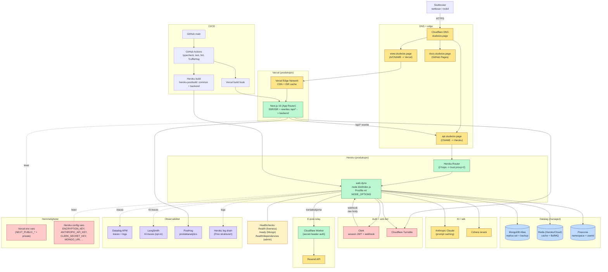

# Produksjonsmiljø

Hvordan en ekte request flyter gjennom produksjon — fra brukerens nettleser, via DNS og CDN, gjennom Vercel og Heroku, til datalag og managed tredjepartstjenester. Viser også observabilitets- og hemmelighets-håndtering.

## Nøkkelkarakteristikker for produksjon

- **HTTPS overalt** — HSTS aktivert i Helmet (`maxAge: 31536000, includeSubDomains`).
- **Trust proxy = 2** — matcher Cloudflare + Heroku Router-hops, ellers blir klient-IP og `req.protocol` feil.
- **Host-validering** — kun `API_HOST` + `INTERNAL_HOSTS` slipper gjennom på backend.
- **Streng CSP** — `default-src 'none'`, `frame-ancestors 'none'` (Swagger UI er deaktivert i prod).
- **Graceful shutdown** — SIGTERM lukker HTTP-server, BullMQ-workers, Mongo og Redis i rekkefølge.
- **Helsestatus** — Heroku poller `/health`; readiness venter på Mongo; admin-only `/health/dependencies` viser Pinecone/Anthropic/Cohere/Clerk/Redis.
- **Kø-resiliens** — BullMQ-workers prøver å starte på nytt med backoff hvis Redis er nede ved oppstart, uten at API-et restartes.
- **Hemmeligheter** — kun via Heroku/Vercel config vars; TruffleHog i CI fanger lekkasjer i kode.
- **Backup** — MongoDB Atlas point-in-time recovery; Pinecone har ingen backup, men kan gjenopprettes fra `ContentEmbedding` (kilde-sannhet for chunk-tekst).
