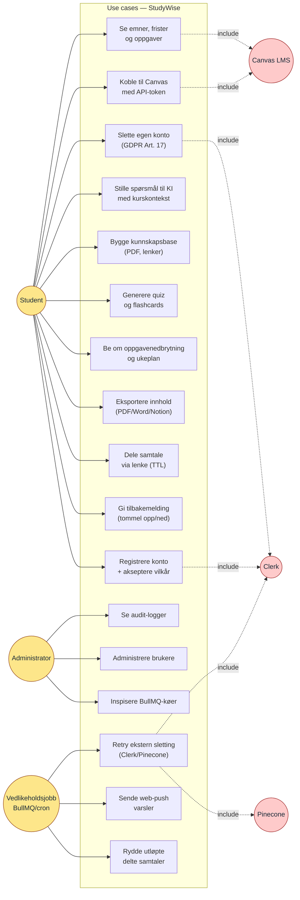

# Use case-diagram

UML-style use case-diagram som viser de viktigste aktørene og hvilke funksjoner de kan utløse i StudyWise. Diagrammet svarer på spørsmålet "hva kan brukeren gjøre med systemet?", og er nyttig for å avgrense omfanget av løsningen i innledningen til bacheloroppgaven.

## Aktører

| Aktør | Beskrivelse |
|-------|-------------|
| **Student** | Primærbruker. Logger inn med Clerk, kobler til Canvas og bruker KI-funksjonene. |
| **Administrator** | Forhøyet rolle for drift og vedlikehold. Egen `/admin`-flate beskyttet av `requireRole("admin")`. |
| **Vedlikeholdsjobb** | Automatiske bakgrunnsprosesser (BullMQ-workers, intervall-pollere). Ingen menneskelig aktør. |
| **Canvas LMS** | Ekstern aktør som leverer kursdata via REST API. |
| **Clerk** | Ekstern aktør for autentisering, sender også webhooks for bruker-livssyklus. |
| **Pinecone** | Ekstern vektortjeneste som brukes ved søk og opprydding av brukerdata. |
