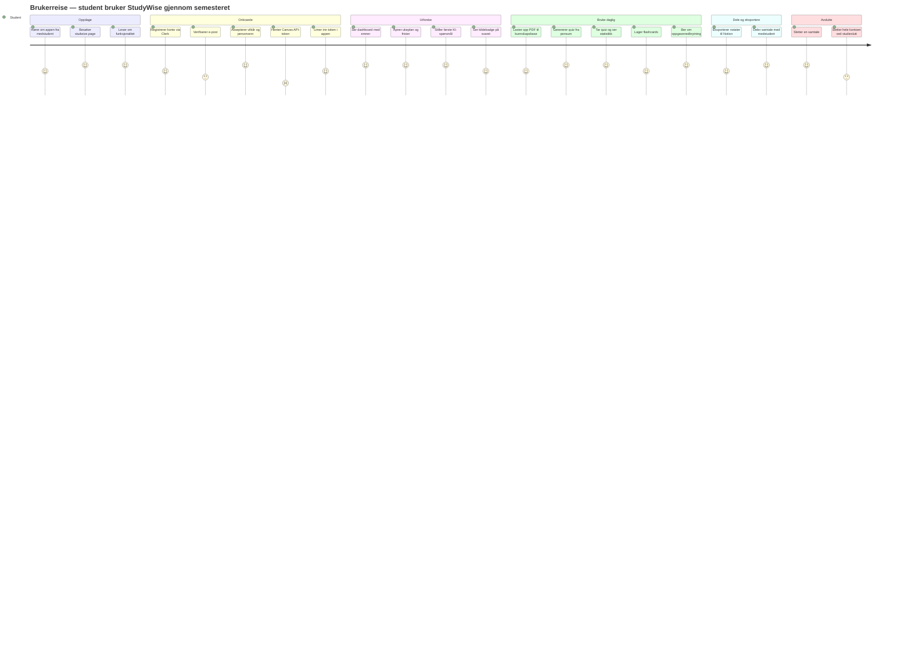

# Brukerreise — student fra registrering til bruk

Viser den typiske reisen en student går gjennom fra de første gangen de hører om StudyWise til de bruker appen i en hverdagssituasjon. Diagrammet er nyttig i UX-delen av bacheloroppgaven for å vise hvordan løsningen er tenkt brukt og hvor de viktigste friksjonspunktene ligger.

## Friksjonspunkter avdekket i brukertest

Brukertesten (se `brukertest-skjema.md`) kartla disse smertepunktene, som er adressert i sluttproduktet:

| Steg | Friksjon | Tiltak |
|------|----------|--------|
| Hente Canvas-token | Studenten må navigere i Canvas-innstillinger | Veiledning med skjermbilder per institusjon, lenkesnarvei, validering før lagring |
| Vente på første sync | Følte seg "henger" | Streaming-progress, "kommer i gang"-empty state, bakgrunns-sync |
| Forstå KI-svarets kilde | Tvil om svaret kom fra eget pensum | `<svarkilde>`-badge: kursmateriale / canvas / kunnskapsbase / blandet / generell |
| Slette konto | Bekymring for at data blir liggende | Eksplisitt step-up auth, bekreftelsesmodal, audit-logg, soft-delete + hard-delete-jobber |
