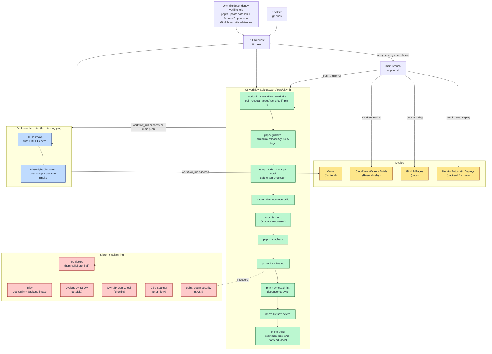

# CI/CD-pipeline (GitHub Actions)

Viser den fulle pipelinen fra kodeendring til offentlig demo / produksjonslik deploy. Inkluderer kvalitetssikring (typecheck, lint, test, build), supply-chain-kontroller (Actions-guardrails, OSV, SBOM, Trivy, TruffleHog) og deploy til Vercel/Heroku/GitHub Pages. Dokumenterer at prosjektet har modne automatiserte rutiner — relevant for vurdering av leveransekvalitet.

## Workflows i `.github/workflows/`

| Workflow | Trigger | Hva den gjør |
|----------|---------|--------------|
| `ci.yml` | Push og PR mot `main` | Actionlint, guardrails, install, unit, typecheck, lint, syncpack, soft-delete lint, build, OSV, SBOM, Trivy og TruffleHog |
| `func-testing.yml` | Manuelt eller etter grønn CI på `main`-push | Lokal Mongo/Redis, backend smoke og Playwright Chromium |
| `deploy.yml` | Etter grønn `Functional Testing` på `main` | Deploy frontend til Vercel fra verifisert commit |
| `deploy.docs.yml` | Endring i `docs/` | Deploy VitePress til GitHub Pages |
| `owasp-dependency-check.yml` | Ukentlig + manuelt | OWASP-skann av avhengigheter |
| `update-dependencies.yml` | Ukentlig + manuelt | `pnpm update:safe` innenfor semver og `minimumReleaseAge`, typecheck/lint/build og PR |

Backend deployes via Heroku Automatic Deploys fra `main`, mens Cloudflare Worker bygges fra `wrangler.toml` i Cloudflare Workers Builds.

## Kvalitetsporter før deploy

For at en commit skal nå offentlig demo / produksjonslik deploy må alle disse passere:

1. **Typer**: TypeScript strict på alle workspace-pakker
2. **Lint**: ESLint, markdown-lint, syncpack og soft-delete guardrail
3. **Tester**: Vitest, backend smoke og Playwright Chromium
4. **Supply chain**: Actions/pnpm guardrails, safe-chain checksum, OSV, SBOM, Trivy, TruffleHog og ukentlig OWASP
5. **Build**: Alle pakker bygger uten feil
6. **Deploy-gate**: Frontend deployes først etter grønn CI + Functional Testing på `main`
