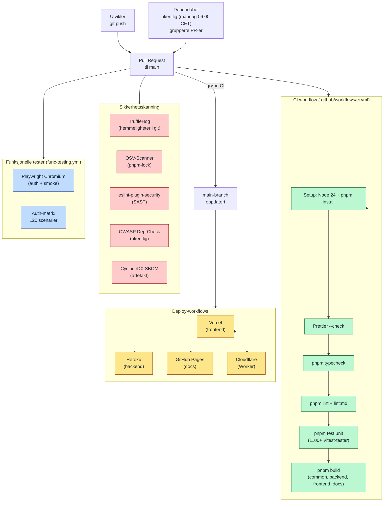

# CI/CD-pipeline (GitHub Actions)

Viser den fulle pipelinen fra kodeendring til offentlig demo / produksjonslik deploy. Inkluderer både kvalitetssikring (typecheck, lint, test, sikkerhetsskanning) og deploy til Vercel/Heroku/GitHub Pages. Dokumenterer at prosjektet har modne automatiserte rutiner — relevant for vurdering av leveransekvalitet.

## Workflows i `.github/workflows/`

| Workflow | Trigger | Hva den gjør |
|----------|---------|--------------|
| `ci.yml` | Push, PR | Format, typecheck, lint, build, enhetstester |
| `func-testing.yml` | Push, PR | Playwright E2E + auth-scenariomatrise |
| `deploy.yml` | Push til `main` | Deploy frontend (Vercel) + backend (Heroku) |
| `deploy.docs.yml` | Endring i `docs/` | Deploy VitePress til GitHub Pages |
| `owasp-dependency-check.yml` | Ukentlig + manuelt | OWASP-skann av avhengigheter |
| `update-dependencies.yml` | Manuelt | Hjelpetjeneste for grupperte oppdateringer |

## Kvalitetsporter før deploy

For at en commit skal nå offentlig demo / produksjonslik deploy må alle disse passere:

1. **Format**: Prettier-konsistens
2. **Typer**: TypeScript strict på alle 5 pakker
3. **Lint**: ESLint + remark for markdown
4. **Tester**: Vitest + Playwright
5. **Sikkerhet**: TruffleHog + OSV + ESLint-security
6. **Build**: Alle pakker bygger uten feil
