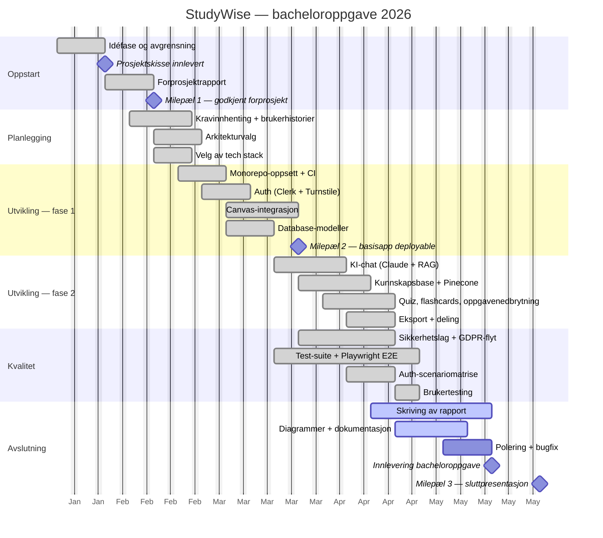

# Milepæler og tidslinje (Gantt)

Prosjektets tidsplan vist som Gantt-diagram. Dekker hele bacheloroppgaveløpet fra oppstart i januar til innlevering og presentasjon i mai/juni 2026. Brukes i metodedelen av oppgaven for å dokumentere planlegging og fremdrift.

## Milepæler

| # | Milepæl | Dato | Leveranse |
|---|---------|------|-----------|
| M1 | Prosjektskisse innlevert | 2026-01-27 | `Prosjektbeskrivelse_gruppe3.pdf` |
| M2 | Forprosjekt godkjent | 2026-02-10 | `BOP-Prosjektskisse-Gruppe3-1.pdf` |
| M3 | Basisapp deployable | 2026-03-24 | Auth + Canvas + dashboard live |
| M4 | Bacheloroppgave innlevert | 2026-05-19 | `BSc/BScThesis.pdf` + kildekode |
| M5 | Sluttpresentasjon | 2026-06-02 | `manus-milepael-3.md` |

## Metodikk

Prosjektet er gjennomført med **Kanban** som arbeidsmetodikk (ikke Scrum), drevet av to GitHub Projects-tavler:

- **Brukerhistorier** (#21) — 55 historier som beskriver "hva" og "hvorfor" fra studentens perspektiv
- **Tekniske issues** (#25) — 187 oppgaver som beskriver "hvordan" hver historie realiseres

Dette ga gruppa fleksibilitet til å jobbe med flere parallelle delsystemer uten faste sprintlengder, samtidig som tavlene ga sporbar dokumentasjon for vurdering.
