# UML klassediagram — kjernetjenester

UML-klassediagram for de viktigste backend-tjenestene som realiserer KI-pipelinen og Canvas-integrasjonen. Diagrammet viser klassenes (modulenes) ansvar, hovedmetoder og deres avhengigheter. Komplementerer det funksjonelle perspektivet i sekvensdiagrammene (3, 4) ved å vise det strukturelle bildet.

I TypeScript er "klasser" ofte realisert som moduler med eksporterte funksjoner; diagrammet abstraherer dette til klassenotasjon for tydelighet.

```mermaid
classDiagram
    class KiRoute {
        +postKiChat(req, res) SSE
        -resolveKnowledgeBaseContext(userId, message) KBContext
        -buildSystemPrompt(context) string
        -saveChatHistory(messages, source) Promise~void~
    }

    class AiClient {
        +chatCompletion(options) Promise~ChatResult~
        +chatCompletionWithVision(options) Promise~ChatResult~
        +extractAnswerAndSource(raw) AnswerWithSource
        +enforceSvarKilde(source, ctx) SvarKilde
        -callAnthropic(options) Promise~SdkResult~
        -callAnthropicWithVision(options) Promise~SdkResult~
    }

    class ContextLoader {
        +loadCanvasContext(userId, courseId, opts) CanvasContext
        +ensureCanvasSync(userId, token, baseUrl) Promise~SyncResult~
        +resolveTargetAgainstKnownCourses(userId, target) Promise~Target~
        -byggKontekstFraHybridSearch(userId, query, target) ContextResult
    }

    class HybridRetrieval {
        +hybridSearch(userId, query, opts) HybridSearchResponse
        -vectorSearch(userId, query) VectorHits
        -bm25Search(userId, query) BM25Hits
        -rerank(query, candidates) RerankedHits
    }

    class CohereRerank {
        +rerank(query, docs, topN) Promise~RerankedDoc[]~
    }

    class PineconeService {
        +pineconeUpsert(records) Promise~void~
        +pineconeQuery(text, filter, topK) Promise~Match[]~
        +pineconeDeleteByFilter(filter) Promise~void~
    }

    class Bm25Service {
        +bm25Search(userId, query, opts) Promise~BM25SearchResponse~
    }

    class EmbeddingService {
        +upsertStoredFileContent(options) Promise~number~
        +vectorSearch(userId, query, opts) Promise~VectorSearchResult[]~
        +deleteStoredUserVectors(userId) Promise~void~
    }

    class CanvasService {
        +fetchCourses(token) Promise~Kurs[]~
        +fetchModules(token, kursId) Promise~Modul[]~
        +fetchFileContent(token, fileId) Promise~Buffer~
        +warmCanvasCache(token) Promise~void~
    }

    class CanvasSyncService {
        +syncCanvasDataForUser(userId) Promise~SyncResult~
        +triggerInitialSync(userId) void
        +invalidateUserCanvasCache(userId) Promise~void~
    }

    class IndexeringService {
        +indexKBContent(options) Promise~number~
        +searchKBContent(userId, baseId, query, topK) Promise~KBSearchResult[]~
        +deleteAllKBContentForUser(userId, baseIds) Promise~void~
        -extractKBQueryTerms(query) string[]
        -sanitizeKBBodyText(text) string
    }

    class KrypteringUtil {
        +encrypt(plaintext) string
        +decrypt(ciphertext) string
        -parseKeyHex(rawKey, label) Buffer
    }

    class RequireAuth {
        +middleware(req, res, next) void
        -verifyClerkToken(token) ClerkUser
        -loadUser(clerkId) Promise~User~
    }

    class KontoSlett {
        +deleteAccountData(userId, opts) Promise~AccountDeletionResult~
        -createTombstone(user) Promise~void~
        -deleteMongoUserData(userId) Promise~void~
        -enqueueRetryOnExternalFailure(userId) Promise~void~
    }

    class ClerkDeletionQueue {
        +process(job) Promise~void~
        -callClerkApi(clerkId) Promise~void~
    }

    class PineconeCleanupQueue {
        +process(job) Promise~void~
        -deleteVectorsForUser(userId) Promise~void~
    }

    KiRoute ..> ContextLoader : Canvas/kursmateriale
    KiRoute ..> IndexeringService : KB search
    KiRoute ..> AiClient : Claude streaming
    ContextLoader ..> CanvasService : Canvas-kontekst
    ContextLoader ..> HybridRetrieval : Canvas/kursmateriale-kontekst
    HybridRetrieval ..> PineconeService : vektorsøk
    HybridRetrieval ..> Bm25Service : nøkkelordsøk
    HybridRetrieval ..> CohereRerank : reranking
    IndexeringService ..> PineconeService : KB upsert/query/delete
    IndexeringService ..> CohereRerank : KB reranking
    CanvasSyncService ..> CanvasService : Canvas API
    CanvasSyncService ..> EmbeddingService : Canvas-innhold
    RequireAuth ..> KrypteringUtil : Canvas-token
    KontoSlett ..> ClerkDeletionQueue : enqueue
    KontoSlett ..> PineconeCleanupQueue : enqueue
    PineconeCleanupQueue ..> PineconeService : filter-slett
```

## Klasse-/modulbeskrivelser

| Klasse | Fil | Hovedansvar |
|--------|-----|-------------|
| `KiRoute` | `backend/src/rutere/ki/ki.ts` | Orkestrerer chat-requesten: Canvas, KB, prompt, streaming og lagring |
| `AiClient` | `backend/src/rutere/ki/aiClient.ts` | Kall Claude via Vercel AI SDK, parse `<svarkilde>`-tag |
| `ContextLoader` | `backend/src/services/context-loader.service.ts` | Sammenstille Canvas-/kursmateriale-kontekst |
| `HybridRetrieval` | `backend/src/services/hybrid-retrieval.service.ts` | Kjøre vektor + BM25 + rerank |
| `CohereRerank` | `backend/src/services/cohere-rerank.service.ts` | Cohere rerank-v3.5 |
| `PineconeService` | `backend/src/services/pinecone.service.ts` | Pinecone upsert/query/delete-by-filter med delt namespace og `userId`-metadata |
| `Bm25Service` | `backend/src/services/bm25.service.ts` | BM25-søk mot Canvas-/kurschunks i `ContentEmbedding` |
| `EmbeddingService` | `backend/src/services/embedding.service.ts` | Lagrer chunks i MongoDB og bruker Pinecone integrated embedding for vektorsøk |
| `CanvasService` | `backend/src/rutere/canvas/canvasService.ts` | Canvas REST API + Redis-cache |
| `CanvasSyncService` | `backend/src/services/canvas-sync.service.ts` | Synkronisering av Canvas-struktur/innhold og cache-invalidasjon |
| `IndexeringService` | `backend/src/services/kunnskapsbase-indeksering.service.ts` | KB-indexering, Pinecone-søk, Cohere-rerank og MongoDB-fallback |
| `KrypteringUtil` | `backend/src/utils/kryptering.ts` | AES-256-GCM kryptering |
| `RequireAuth` | `backend/src/middleware/auth.ts` | Clerk Bearer-verifisering |
| `KontoSlett` | `backend/src/rutere/auth/kontoSlett.ts` | Hard delete + tombstone + retry-enqueue for Clerk/Pinecone |
| `ClerkDeletionQueue` | `backend/src/queues/clerkDeletion.queue.ts` | BullMQ-prosessor |
| `PineconeCleanupQueue` | `backend/src/queues/pineconeCleanup.queue.ts` | BullMQ-prosessor |

## Designmønstre brukt

| Mønster | Hvor | Hensikt |
|---------|------|---------|
| **Service Layer** | `services/` | Skille forretningslogikk fra ruter |
| **Adapter** | `aiClient`, `pinecone.service` | Innkapsle eksterne APIer |
| **Strategy** | `HybridRetrieval` | Bytte mellom vektor / BM25 / hybrid |
| **Queue (Producer/Consumer)** | BullMQ-køer | Asynkron prosessering med retry |
| **Middleware (Chain of Responsibility)** | Express middleware | Sikkerhetslag før handler |
| **Repository (light)** | Mongoose-modeller | Innkapslet datatilgang |
