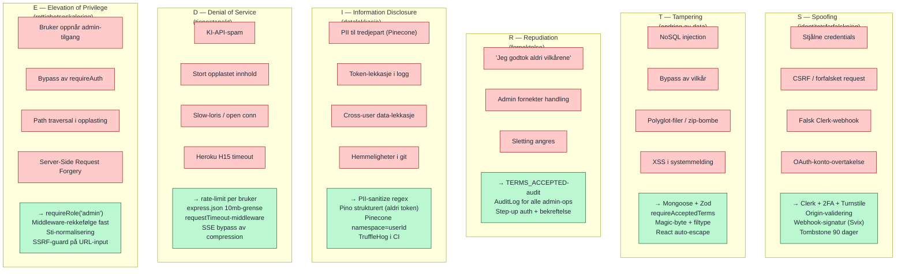

# STRIDE-trusselmodell

Visuell oppsummering av STRIDE-trusselmodellen som er detaljert i `compliance/THREAT_MODEL.md`. STRIDE er et industristandard rammeverk fra Microsoft for å klassifisere sikkerhetstrusler. Hver bokstav representerer én kategori; diagrammet viser de viktigste truslene mot StudyWise og hvilke tiltak som adresserer hver.

## Tilknyttet dokumentasjon

| Dokument | Innhold |
|----------|---------|
| [`compliance/THREAT_MODEL.md`](../../compliance/THREAT_MODEL.md) | Full STRIDE-tabell med vektorer og tiltak |
| [`compliance/PIA.md`](../../compliance/PIA.md) | Privacy Impact Assessment (GDPR Art. 35) |
| [`compliance/INCIDENT_RESPONSE.md`](../../compliance/INCIDENT_RESPONSE.md) | Hendelseshåndtering og varsling |
| Diagram 11 — sikkerhetslag | 15 lag forsvar i dybden |
| Diagram 09 — bruker-sletting | GDPR-implementasjon |
