# WBS — Work Breakdown Structure

Dekomponering av bacheloroppgaven i hierarkiske leveranser. WBS er et standard prosjektledelsesverktøy som viser hvordan totalprosjektet brytes ned i håndterbare arbeidspakker. Denne strukturen samsvarer med både `kanban-brukerhistorier.txt` (55 historier) og `teknisk-kanban-issues.txt` (187 issues).

```mermaid
flowchart TB
    ROOT["1.0 StudyWise<br/>Bacheloroppgave 2026"]

    ROOT --> A["1.1 Prosjektledelse"]
    ROOT --> B["1.2 Forprosjekt"]
    ROOT --> C["1.3 Utvikling"]
    ROOT --> D["1.4 Kvalitet og sikkerhet"]
    ROOT --> E["1.5 Dokumentasjon"]
    ROOT --> F["1.6 Drift og leveranse"]

    A --> A1["1.1.1 Kanban-styring<br/>(GitHub Projects)"]
    A --> A2["1.1.2 Møter og statusrapport"]
    A --> A3["1.1.3 Risikohåndtering"]
    A --> A4["1.1.4 Veiledermøter"]

    B --> B1["1.2.1 Idé og avgrensning"]
    B --> B2["1.2.2 Prosjektskisse"]
    B --> B3["1.2.3 Forprosjektrapport"]
    B --> B4["1.2.4 Tech stack-valg"]

    C --> C1["1.3.1 Infrastruktur"]
    C --> C2["1.3.2 Frontend"]
    C --> C3["1.3.3 Backend"]
    C --> C4["1.3.4 Datalag"]
    C --> C5["1.3.5 KI-integrasjon"]
    C --> C6["1.3.6 Canvas-integrasjon"]

    C1 --> C1a["pnpm monorepo"]
    C1 --> C1b["Docker compose"]
    C1 --> C1c["GitHub Actions"]
    C2 --> C2a["Next.js + Tailwind"]
    C2 --> C2b["Komponenter (UI/KI)"]
    C2 --> C2c["i18n + dark mode"]
    C3 --> C3a["Express + middleware"]
    C3 --> C3b["Routers per feature"]
    C3 --> C3c["BullMQ workers"]
    C4 --> C4a["MongoDB + Mongoose"]
    C4 --> C4b["Redis cache"]
    C4 --> C4c["Pinecone vektorer"]
    C5 --> C5a["Claude chat (RAG)"]
    C5 --> C5b["Quiz/flashcards"]
    C5 --> C5c["Kunnskapsbase"]
    C6 --> C6a["Token-håndtering"]
    C6 --> C6b["Sync + cache"]
    C6 --> C6c["Kursdata-indeksering"]

    D --> D1["1.4.1 Enhetstester"]
    D --> D2["1.4.2 E2E + matrise"]
    D --> D3["1.4.3 Sikkerhetsskanning"]
    D --> D4["1.4.4 GDPR + retention"]
    D --> D5["1.4.5 Brukertest"]
    D --> D6["1.4.6 Trusselmodell"]

    E --> E1["1.5.1 Bacheloroppgaven (LaTeX)"]
    E --> E2["1.5.2 Diagrammer"]
    E --> E3["1.5.3 VitePress docs"]
    E --> E4["1.5.4 Compliance-dokumenter"]
    E --> E5["1.5.5 Brukerhåndbok"]

    F --> F1["1.6.1 Vercel-deploy"]
    F --> F2["1.6.2 Heroku-deploy"]
    F --> F3["1.6.3 GitHub Pages"]
    F --> F4["1.6.4 Cloudflare Worker"]
    F --> F5["1.6.5 Observabilitet<br/>(Datadog, PostHog, LangSmith)"]

    classDef root fill:#1f2937,color:#fff,stroke:#000
    classDef l1 fill:#fde68a,stroke:#92400e,color:#1f2937
    classDef l2 fill:#bfdbfe,stroke:#1e3a8a,color:#1f2937
    classDef l3 fill:#bbf7d0,stroke:#166534,color:#1f2937
    class ROOT root
    class A,B,C,D,E,F l1
    class A1,A2,A3,A4,B1,B2,B3,B4,C1,C2,C3,C4,C5,C6,D1,D2,D3,D4,D5,D6,E1,E2,E3,E4,E5,F1,F2,F3,F4,F5 l2
    class C1a,C1b,C1c,C2a,C2b,C2c,C3a,C3b,C3c,C4a,C4b,C4c,C5a,C5b,C5c,C6a,C6b,C6c l3
```

## Arbeidspakker — eierskap

| Pakke | Hovedansvarlig | Involvert |
|-------|----------------|-----------|
| 1.1 Prosjektledelse | Laurent | Alle |
| 1.2 Forprosjekt | Alle | – |
| 1.3.1–1.3.4 Infra/data | Laurent | Abdinasir, Anwar |
| 1.3.5 KI-integrasjon | Abdinasir, Anwar | Laurent |
| 1.3.6 Canvas | Laurent | Abdinasir |
| 1.4 Kvalitet | Laurent | Alle |
| 1.5 Dokumentasjon | Ylli | Alle |
| 1.6 Drift | Laurent | – |

## Sammenheng med Kanban-tavlen

| WBS-nivå | Tilsvarer | Antall |
|----------|-----------|--------|
| 1.x (hovedpakker) | Tematiske grupper i Kanban | 6 |
| 1.x.y (delpakker) | Brukerhistorier | 55 |
| 1.x.y.z (oppgaver) | Tekniske issues | 187 |
