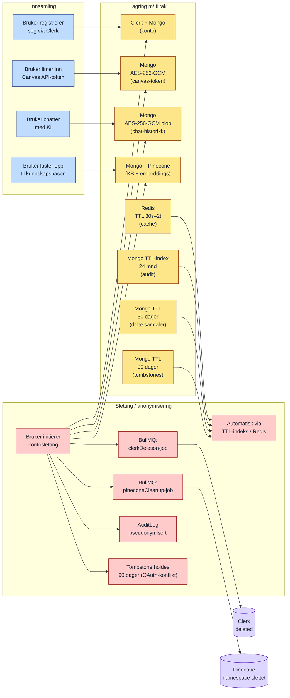

# GDPR — datalivssyklus og lagringstid

Visuell oppsummering av retention-reglene i `compliance/DATA_RETENTION.md`. Diagrammet viser livsløpet til persondata fra innsamling til sletting eller anonymisering, og hvilke automatiske mekanismer som håndhever lagringsbegrensningen (GDPR Art. 5(1)(e)).

## Retention-tabell (forenklet)

| Datatype | Hvor | Levetid | Sletting |
|----------|------|---------|----------|
| Konto (e-post, navn) | Clerk + Mongo | Til kontosletting | Bruker-initiert |
| Canvas API-token | Mongo (AES-256-GCM) | Til bruker fjerner | Manuelt eller v/ kontosletting |
| Chat-historikk | Mongo (AES-256-GCM) | Til bruker sletter | Per samtale eller alt |
| Kunnskapsbase | Mongo + Pinecone | Til bruker sletter | Kaskade via BullMQ |
| Canvas-cache | Redis | 2 timer (sync) | Automatisk TTL |
| Audit-logger | Mongo TTL | 24 måneder | TTL + anonymisering |
| Delte samtaler | Mongo TTL | 30 dager | Automatisk TTL |
| Tombstone (OAuth) | Mongo TTL | 90 dager | Automatisk TTL |
| Sesjonstokens | Clerk | Per Clerk-config | Logout/utløp |

## GDPR-rettigheter dekket

| Rett | Implementasjon |
|------|----------------|
| **Art. 15 — Innsyn** | Kontoeksport til Notion/Word/PDF |
| **Art. 16 — Korreksjon** | Bruker kan oppdatere konto via Clerk + appen |
| **Art. 17 — Sletting** | Soft-delete + BullMQ-jobber + tombstone (se diagram 9) |
| **Art. 20 — Dataportabilitet** | KI-eksport til standardformater |
| **Art. 33 — Varsling** | INCIDENT_RESPONSE.md (72-timers varsling) |
| **Art. 35 — DPIA** | Dokumentert i PIA.md |
