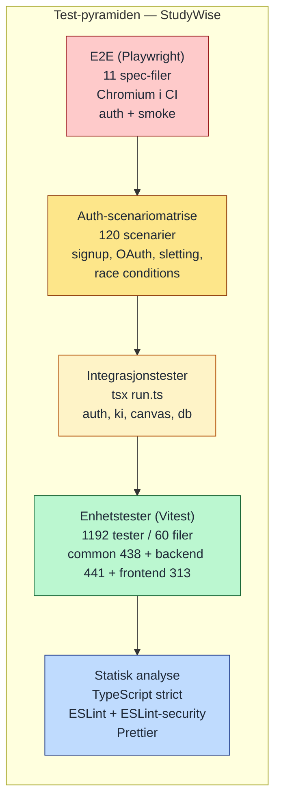

# Teststrategi (test-pyramide + dekningsområder)

Viser hvilke testtyper som dekker hvilket abstraksjonsnivå i StudyWise. Test-pyramiden er en standard modell for å vise at lave testnivåer (raske, mange) bør dominere over høye (tregere, færre). I tillegg viser tabellen hvilke domener som testes hvor.



## Hva testes hvor

| Domene | Enhet (Vitest) | Integrasjon (tsx run.ts) | E2E (Playwright) | Sikkerhet (CI) |
|--------|:---------------:|:------------------------:|:----------------:|:--------------:|
| Skjemavalidering (Zod) | ✓ | – | – | – |
| Kryptering (AES-256-GCM) | ✓ | ✓ | – | – |
| Auth (Clerk-flyt) | ✓ | ✓ | ✓ | – |
| Auth-scenariomatrise | – | – | ✓ (120) | – |
| KI-pipeline (mock + ekte) | ✓ | ✓ | – | – |
| Canvas-API (mock) | ✓ | ✓ | – | – |
| RAG / hybrid-retrieval | ✓ | – | – | – |
| Rate limiting / CSRF | ✓ | ✓ | ✓ | – |
| SSRF-guards | ✓ | – | – | – |
| Sanitization / XSS | ✓ | – | ✓ | ✓ (ESLint-security) |
| Hemmeligheter i git | – | – | – | ✓ (TruffleHog) |
| Sårbare avhengigheter | – | – | – | ✓ (OSV + OWASP) |
| Database-migrasjoner | ✓ | ✓ | – | – |
| Tilgjengelighet (a11y) | – | – | ✓ (axe-core) | – |

## Spesifikke testkommandoer

```bash
pnpm test:unit              # Alle enhetstester (~1192 totalt)
pnpm test:auth:matrix       # 120 auth-scenarier
pnpm test:auth:e2e          # Playwright Chromium
pnpm test:ki:smoke          # Rask KI-røyktest
pnpm test:canvas:smoke      # Rask Canvas-røyktest
```

## Hvorfor pyramiden ser slik ut

- **Statisk analyse** og **enhetstester** er gratis å kjøre tusenvis av ganger og fanger de fleste regresjoner umiddelbart.
- **Integrasjonstester** verifiserer at moduler henger sammen riktig — særlig auth, kryptering og databasekall.
- **Auth-scenariomatrisen** ble laget fordi auth er den mest sikkerhetskritiske flyten i appen og krever uttømmende dekning av kantkasus (OAuth-konflikter, race conditions, gjenbruk av e-post etter sletting).
- **E2E** holdes tynt og fokusert — kun kritiske brukerstier — for å holde CI-tiden lav.
