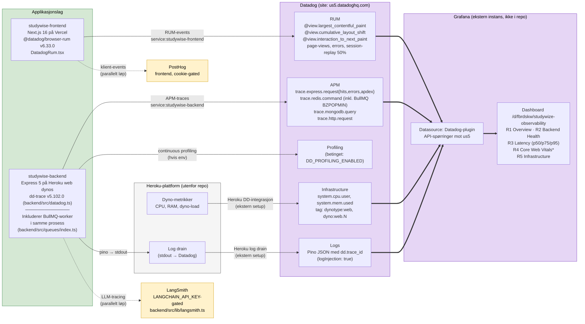

# Observability-stack: Datadog og Grafana

Hvordan signaler fra applikasjonen flyter til Datadog (us5) og videre til det eksterne Grafana-dashboardet. Frontend bruker Datadog RUM Browser SDK (`@datadog/browser-rum` v6.33.0, initialisert i `frontend/app/components/layout/DatadogRum.tsx:65-154` med service-navn `studywise-frontend`). Backend bruker Node.js APM-agenten `dd-trace` v5.102.0 (initialisert tidlig i `backend/src/datadog.ts:11-52` og importert først i `backend/src/index.ts:15`, med service-navn `studywise-backend`). Begge skrur seg av hvis `DD_API_KEY` mangler.

BullMQ-worker kjører i samme prosess som Express-backenden (`Procfile:1` har kun én `web`-prosess, og `backend/src/queues/index.ts:1-9` beskriver én unified worker). BullMQ-spans rapporteres derfor under `studywise-backend`-tjenesten via dd-trace's auto-instrumentation av Redis-klienten, ikke som en egen Datadog-service. Tag-distribusjonen er kritisk: APM-traces har `service:studywise-backend`, RUM-events har `service:studywise-frontend`, mens Heroku-dynoinfrastrukturmetrikker mangler `service:`-tag og må filtreres med `dynotype:web` / `dyno:web.N`.

Logger-pipelinen er litt indirekte: Pino (`backend/src/utils/logger.ts:62-186`) skriver strukturert JSON til stdout med `dd.trace_id` / `dd.span_id` injisert automatisk (`datadog.ts:26` setter `logInjection: true`). Det er en Heroku log drain (konfigurert i Heroku-dashboard, *ikke* i koden) som faktisk videresender stdout-loggen til Datadog. Tilsvarende gjelder dyno-metrikkene — Heroku Datadog-integrasjonen settes opp utenfor repoet.

Grafana lever som ekstern instans og henter all data via Datadog-pluginen mot us5. Det er ingen Grafana-config, dashboard-JSON eller SDK i kodebasen — Grafana-koblingen er en lenke i admin-grensesnittet (`frontend/app/components/admin/AdminSection.tsx`). LangSmith (`backend/src/lib/langsmith.ts`, `LANGCHAIN_API_KEY`-gated) og PostHog (`frontend`, cookie-gated) er parallelle observabilitetsløp som *ikke* går via Datadog — de er tegnet med stiplet linje for å gi det fulle bildet.

`*` Core Web Vitals-panelene viser "No data" fordi Grafanas Datadog-plugin returnerer 400 for `@view.*`-felter via API. Panelene må konfigureres manuelt i Grafana sin panel-editor med RUM measure picker.
