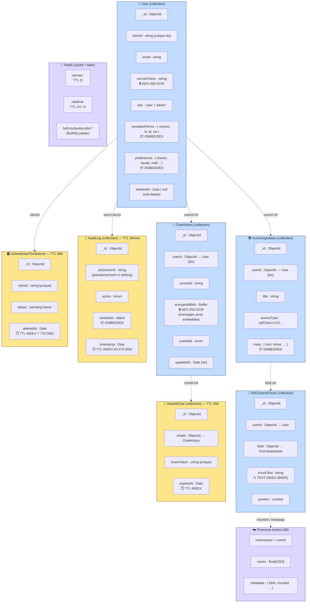

# NoSQL document-modell (MongoDB)

Mens diagram 7 viser en klassisk ER-stil for Mongoose-modellene, dokumenterer dette diagrammet hvordan dataene faktisk er strukturert i MongoDB — hvilke felter som er **embedded** (ligger inne i dokumentet), hvilke som er **referenced** (ObjectId-kobling), hvilke som er **kryptert blob**, og hvilke indekser som er kritiske for ytelse, GDPR-retention og sikkerhet.

NoSQL-dokumentmodellering er forskjellig fra relasjonell modellering: vi velger embed når dataene alltid leses sammen, og reference når de gjenbrukes eller endres uavhengig.

## Modelleringsvalg

| Mønster | Hvor brukt | Hvorfor |
|---------|------------|---------|
| **Embedded subdocument** | `User.preferences`, `User.acceptedTerms`, `Kunnskapsbase.meta`, `AuditLog.metadata` | Leses alltid sammen med foreldredokumentet, små i størrelse, ikke gjenbrukt på tvers. |
| **Referenced (ObjectId)** | `userId` på de fleste collections | Brukerdata er nav; én bruker har mange chats/KB-er, og dokumentene kan leses uavhengig. |
| **Encrypted blob** | `User.canvasToken`, `ChatHistory.encryptedBlob` | Sensitive data skal være ulesbare uten `ENCRYPTION_KEY`, selv ved lekkasje fra DB-backup. |
| **TTL-indeks** | `AuditLog`, `SharedChat`, `DeletedUserTombstone` | GDPR-retention håndheves automatisk av MongoDB; ingen avhengighet av cron-jobber. |
| **Text-indeks** | `KBContentChunk.chunkText` | BM25-søk i hybrid retrieval — MongoDB håndterer det native. |
| **External vektor-DB** | Pinecone (med `namespace=userId`) | MongoDB støtter ikke ANN-søk på samme kvalitetsnivå; Pinecone er optimalisert for embeddings. |

## Kritiske indekser (auditerbare via `db.collection.getIndexes()`)

| Collection | Indeks | Type | Formål |
|------------|--------|------|--------|
| `User` | `{ clerkId: 1 }` | unique | Sync mot Clerk |
| `User` | `{ email: 1 }` | unique | Login-oppslag |
| `ChatHistory` | `{ userId: 1, updatedAt: -1 }` | compound | Liste samtaler i nyeste rekkefølge |
| `Kunnskapsbase` | `{ userId: 1 }` | secondary | Brukerens KB-oversikt |
| `KBContentChunk` | `{ chunkText: "text" }` | text | BM25-søk |
| `AuditLog` | `{ timestamp: 1 }` | TTL (24mnd) | Auto-sletting |
| `SharedChat` | `{ expiresAt: 1 }` | TTL (30d) | Auto-sletting |
| `DeletedUserTombstone` | `{ deletedAt: 1 }` | TTL (90d) | OAuth-konflikthåndtering |

## Hvorfor en egen NoSQL-modell — og ikke bare ER

ER-diagrammer fra relasjonell verden formidler ikke:

- **Hva som er kryptert** (sikkerhetslag) ⇒ vist med 🔒-merke
- **Hva som lever på TTL** (GDPR-retention) ⇒ vist med ⏱️-merke
- **Embedded vs referenced** (NoSQL-spesifikk avgjørelse) ⇒ vist med 📦-merke
- **Eksterne stores** (Pinecone, Redis) som er en del av datamodellen totalt sett

Dette diagrammet komplementerer derfor diagram 7 (ER) ved å vise den faktiske MongoDB-strukturen.
