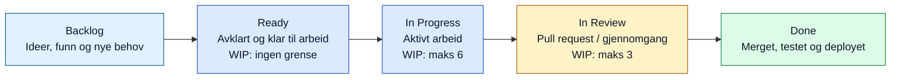

# Figur 1 - Kanban-flyt i GitHub Projects

Sett inn i kapittel 3.1.1, rett etter teksten som introduserer Figur 1.

```mermaid
flowchart LR
    BACKLOG["Backlog<br/>Ideer, funn og nye behov"]
    READY["Ready<br/>Avklart og klar til arbeid<br/>WIP: ingen grense"]
    PROGRESS["In Progress<br/>Aktivt arbeid<br/>WIP: maks 6"]
    REVIEW["In Review<br/>Pull request / gjennomgang<br/>WIP: maks 3"]
    DONE["Done<br/>Merget, testet og deployet"]

    BACKLOG --> READY --> PROGRESS --> REVIEW --> DONE

    classDef backlog fill:#e0f2fe,stroke:#075985,color:#0f172a
    classDef active fill:#dbeafe,stroke:#1d4ed8,color:#0f172a
    classDef review fill:#fef3c7,stroke:#b45309,color:#0f172a
    classDef done fill:#dcfce7,stroke:#15803d,color:#0f172a

    class BACKLOG backlog
    class READY,PROGRESS active
    class REVIEW review
    class DONE done
```

Bildetekst: Figur 1: Vår Kanban-flyt med WIP-grenser.
