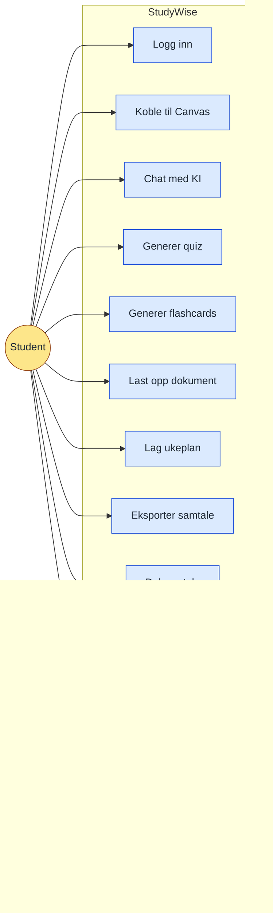

# Figur 2 - Use case-diagram for StudyWise

Forenklet use case-diagram til hovedteksten i kapittel 3.2.4. Den fullstendige varianten ligger som `vedlegg-k-use-case-diagram.png`.

Bildetekst: Figur 2: Use case-diagram for StudyWise.
