# Figur 3 - Monorepo med fem pakker og build-rekkefølge

Rapporttilpasset versjon av monorepo-diagrammet. Viser at `common` må bygges først, at `backend`, `frontend` og `docs` kan bygges etterpå, og at `tests` kjøres sist mot de ferdige pakkene.

```mermaid
flowchart TB
    subgraph Repo["StudyWise / pnpm workspaces"]
        direction TB
        COMMON["common/<br/>Zod-skjemaer + delte typer"]
        BACKEND["backend/<br/>Express 5 API"]
        FRONTEND["frontend/<br/>Next.js 16 App Router"]
        DOCS["docs/<br/>VitePress dokumentasjon"]
        TESTS["tests/<br/>Playwright + integrasjonstester"]
    end

    BACKEND -->|importerer typer| COMMON
    FRONTEND -->|importerer typer| COMMON
    TESTS -->|importerer typer| COMMON
    TESTS -. tester .-> BACKEND
    TESTS -. tester .-> FRONTEND

    BUILD1["1. common"]:::note
    BUILD2["2. backend, frontend og docs<br/>parallelt etter common"]:::note
    BUILD3["3. tests sist"]:::note

    BUILD1 --> BUILD2 --> BUILD3
    COMMON -. bygges i .-> BUILD1
    BACKEND -. bygges i .-> BUILD2
    FRONTEND -. bygges i .-> BUILD2
    DOCS -. bygges i .-> BUILD2
    TESTS -. kjøres i .-> BUILD3

    classDef note fill:#fef3c7,stroke:#b45309,color:#1f2937
    classDef shared fill:#ddd6fe,stroke:#5b21b6,color:#1f2937
    classDef app fill:#bbf7d0,stroke:#166534,color:#1f2937
    classDef testpkg fill:#fecaca,stroke:#991b1b,color:#1f2937
    classDef docpkg fill:#bfdbfe,stroke:#1e3a8a,color:#1f2937
    class COMMON shared
    class BACKEND,FRONTEND app
    class TESTS testpkg
    class DOCS docpkg
```

Bildetekst: Figur 3: Monorepoet med fem pakker og build-rekkefølge.
