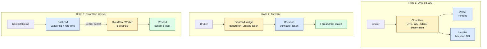

# Figur 6 - Cloudflare i tre roller

Sett inn i kapittel 3.3.4, rett etter forklaringen av DNS/WAF, Turnstile og Worker.

```mermaid
flowchart TB
    subgraph DNS["Rolle 1: DNS og WAF"]
        USER1["Bruker"] --> CF1["Cloudflare<br/>DNS, WAF, DDoS-beskyttelse"]
        CF1 --> VERCEL["Vercel<br/>frontend"]
        CF1 --> HEROKU["Heroku<br/>backend API"]
    end

    subgraph TURNSTILE["Rolle 2: Turnstile"]
        USER2["Bruker"] --> WIDGET["Frontend-widget<br/>genererer Turnstile-token"]
        WIDGET --> API_VERIFY["Backend<br/>verifiserer token"]
        API_VERIFY --> ALLOW["Forespørsel tillates"]
    end

    subgraph WORKER["Rolle 3: Cloudflare Worker"]
        CONTACT["Kontaktskjema"] --> BACKEND["Backend<br/>validering + rate limit"]
        BACKEND -->|Bearer secret| CFW["Cloudflare Worker<br/>e-postrele"]
        CFW --> RESEND["Resend<br/>sender e-post"]
    end

    classDef cf fill:#fef3c7,stroke:#b45309,color:#111827
    classDef app fill:#dbeafe,stroke:#1d4ed8,color:#111827
    classDef ok fill:#dcfce7,stroke:#15803d,color:#111827

    class CF1,WIDGET,CFW cf
    class VERCEL,HEROKU,API_VERIFY,BACKEND app
    class ALLOW,RESEND ok
```

Bildetekst: Figur 6: Cloudflare i tre roller - DNS+WAF, Turnstile, Worker.
