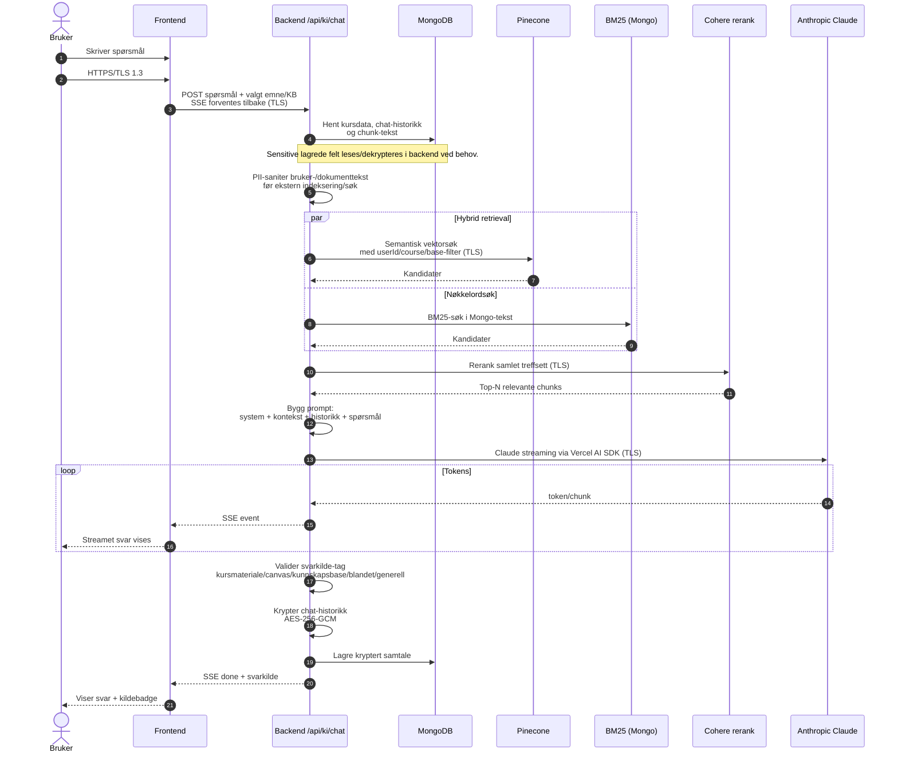

# Figur 8 - KI-chat med hybrid retrieval

Rapporttilpasset sekvensdiagram som viser hele kjeden fra spørsmål til SSE-strøm tilbake, inkludert TLS-grenser, PII-sanitering og kryptert lagring.

Bildetekst: Figur 8: Sekvensdiagram for KI-chat med hybrid retrieval.
