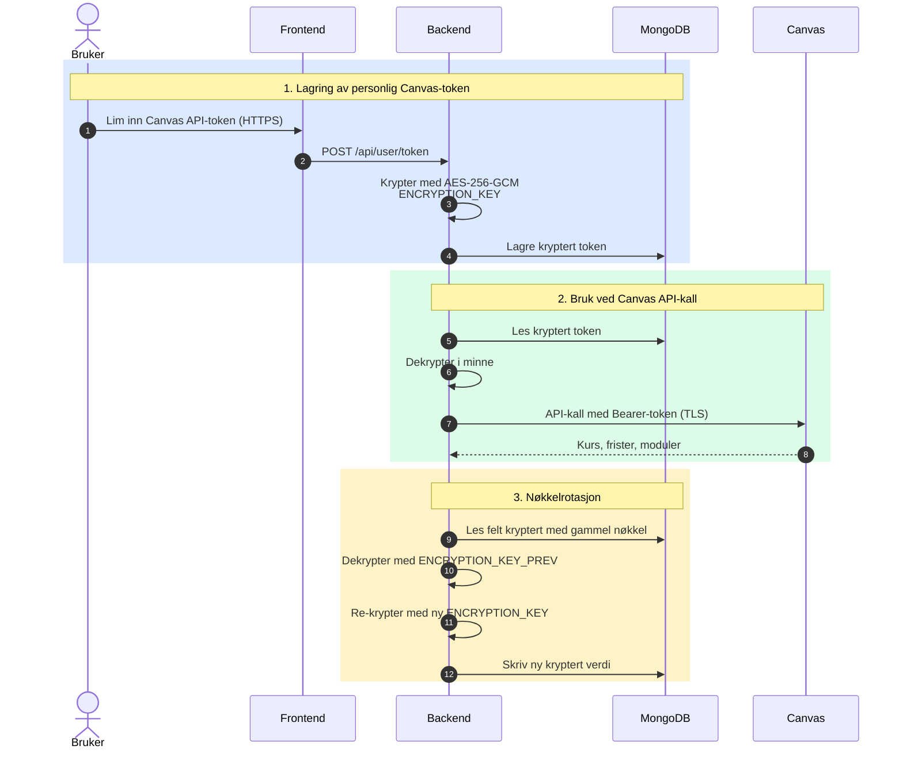

# Figur 9 - Canvas-token: lagring, bruk og rotasjon

Sett inn i kapittel 3.4.2, under avsnittet "Canvas-token og kryptering".

```mermaid
sequenceDiagram
    autonumber
    actor Bruker
    participant Frontend
    participant Backend
    participant MongoDB
    participant Canvas

    rect rgb(219, 234, 254)
        note over Bruker,MongoDB: 1. Lagring av personlig Canvas-token
        Bruker->>Frontend: Lim inn Canvas API-token (HTTPS)
        Frontend->>Backend: POST /api/user/token
        Backend->>Backend: Krypter med AES-256-GCM<br/>ENCRYPTION_KEY
        Backend->>MongoDB: Lagre kryptert token
    end

    rect rgb(220, 252, 231)
        note over Backend,Canvas: 2. Bruk ved Canvas API-kall
        Backend->>MongoDB: Les kryptert token
        Backend->>Backend: Dekrypter i minne
        Backend->>Canvas: API-kall med Bearer-token (TLS)
        Canvas-->>Backend: Kurs, frister, moduler
    end

    rect rgb(254, 243, 199)
        note over Backend,MongoDB: 3. Nøkkelrotasjon
        Backend->>MongoDB: Les felt kryptert med gammel nøkkel
        Backend->>Backend: Dekrypter med ENCRYPTION_KEY_PREV
        Backend->>Backend: Re-krypter med ny ENCRYPTION_KEY
        Backend->>MongoDB: Skriv ny kryptert verdi
    end
```

Bildetekst: Figur 9: Canvas-token: lagring, bruk og rotasjon.
