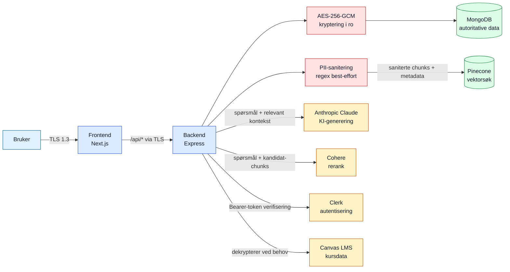

# Figur 12 - Dataflyt med kryptering og PII-sanitering

Sett inn i kapittel 3.6.2, etter teksten om PIA, SCC/DPF og dataflyt.

```mermaid
flowchart LR
    USER["Bruker"]
    FE["Frontend<br/>Next.js"]
    BE["Backend<br/>Express"]
    ENC["AES-256-GCM<br/>kryptering i ro"]
    MONGO[("MongoDB<br/>autoritative data")]
    SAN["PII-sanitering<br/>regex best-effort"]
    PINE[("Pinecone<br/>vektorsøk")]
    ANTH["Anthropic Claude<br/>KI-generering"]
    COHERE["Cohere<br/>rerank"]
    CLERK["Clerk<br/>autentisering"]
    CANVAS["Canvas LMS<br/>kursdata"]

    USER -->|TLS 1.3| FE
    FE -->|/api/* via TLS| BE
    BE --> ENC --> MONGO
    BE -->|dekrypterer ved behov| CANVAS
    BE --> SAN -->|saniterte chunks + metadata| PINE
    BE -->|spørsmål + relevant kontekst| ANTH
    BE -->|spørsmål + kandidat-chunks| COHERE
    BE -->|Bearer-token verifisering| CLERK

    classDef user fill:#e0f2fe,stroke:#075985,color:#111827
    classDef app fill:#dbeafe,stroke:#1d4ed8,color:#111827
    classDef privacy fill:#fee2e2,stroke:#b91c1c,color:#111827
    classDef data fill:#dcfce7,stroke:#15803d,color:#111827
    classDef ext fill:#fef3c7,stroke:#b45309,color:#111827

    class USER user
    class FE,BE app
    class ENC,SAN privacy
    class MONGO,PINE data
    class ANTH,COHERE,CLERK,CANVAS ext
```

Bildetekst: Figur 12: Dataflyt med kryptering og PII-sanitering.
