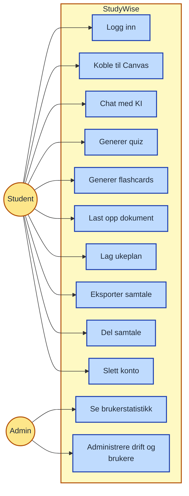

# Figur 2: Forenklet bruksmønsterdiagram

Forenklet bruksmønsterdiagram for hovedrapporten. Systemmeldinger er dekket av
"Administrere drift og brukere".

```mermaid
%%{init: {"flowchart": {"curve": "basis", "htmlLabels": true, "nodeSpacing": 26, "rankSpacing": 50}}}%%
flowchart LR
    Student((Student))
    Admin((Admin))

    subgraph StudyWise["StudyWise"]
        UC1["Logg inn"]
        UC2["Koble til Canvas"]
        UC3["Chat med KI"]
        UC4["Generer quiz"]
        UC5["Generer flashcards"]
        UC6["Last opp dokument"]
        UC7["Lag ukeplan"]
        UC8["Eksporter samtale"]
        UC9["Del samtale"]
        UC10["Slett konto"]
        UC11["Se brukerstatistikk"]
        UC12["Administrere drift og<br/>brukere"]
    end

    Student --> UC1
    Student --> UC2
    Student --> UC3
    Student --> UC4
    Student --> UC5
    Student --> UC6
    Student --> UC7
    Student --> UC8
    Student --> UC9
    Student --> UC10

    Admin --> UC11
    Admin --> UC12

    classDef actor fill:#fde68a,stroke:#b45309,stroke-width:2px,color:#1f2937
    classDef usecase fill:#bfdbfe,stroke:#1e40af,stroke-width:2px,color:#1f2937
    class Student,Admin actor
    class UC1,UC2,UC3,UC4,UC5,UC6,UC7,UC8,UC9,UC10,UC11,UC12 usecase
    style StudyWise fill:#fef9c3,stroke:#b45309,stroke-width:2px,color:#1f2937
```
